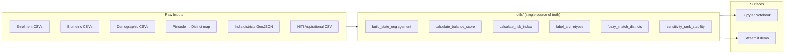
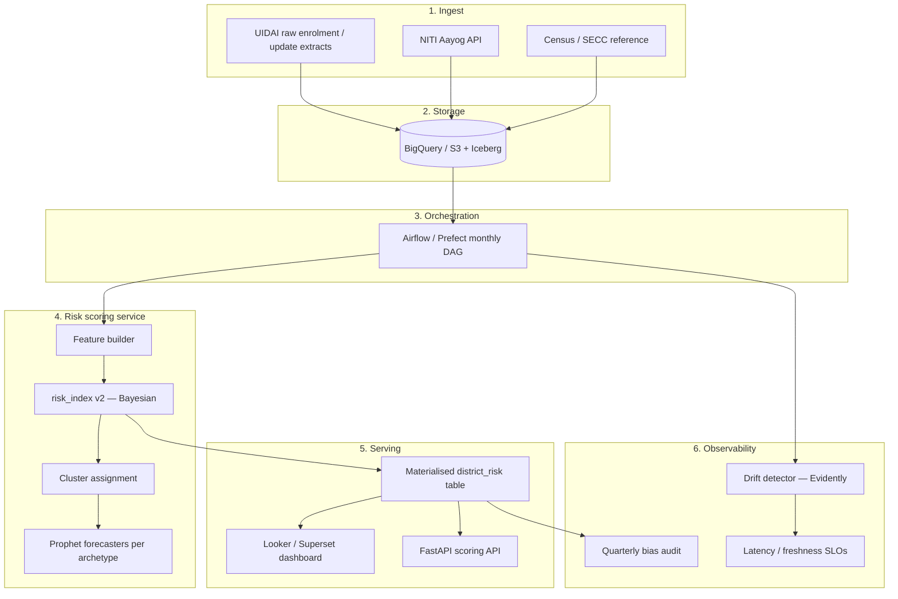

# Architecture — Aadhaar Identity Maintenance Risk Framework

This document describes how the project is structured today (the "notebook +
helpers + Streamlit demo" shape) and how it would be productionised. It is
written for the reader who would be expected to take the prototype and ship
it inside UIDAI / a state IT department.

---

## 1. Current shape (what's in this repo)



Key principle: **all numerical logic lives in `utils/`**. The notebook and the
Streamlit app are both thin clients on top of the same functions, so a
methodology change in `utils/helpers.py` propagates everywhere automatically
and is unit-tested.

---

## 2. Proposed production architecture



### 2.1 Scoring API (FastAPI sketch)

```python
# api/main.py — illustrative, not in this repo
from fastapi import FastAPI, HTTPException
from utils.helpers import calculate_risk_index

app = FastAPI(title="Aadhaar Risk Service")

@app.get("/risk/district/{name}")
def score(name: str) -> dict:
    row = REGISTRY.lookup(name)            # cached materialised view
    if row is None:
        raise HTTPException(404, "district not found")
    return {
        "district": name,
        "p_failure": row.p_failure,
        "impact": row.impact,
        "risk": row.identity_maintenance_risk,
        "archetype": row.archetype,
        "risk_level": row.risk_level,
        "as_of": row.snapshot_date,
        "model_version": MODEL_VERSION,
    }
```

The API returns **decomposed** scores so policy teams can audit which component
(P(failure) vs Impact) is driving a given alert.

### 2.2 Refresh DAG (Airflow / Prefect)

| Task               | Frequency | Notes                                          |
|--------------------|-----------|------------------------------------------------|
| `extract_uidai`    | Daily     | Incremental load to BigQuery                   |
| `build_features`   | Monthly   | District aggregation + balance + slope features|
| `score_risk`       | Monthly   | Runs `calculate_risk_index` over latest batch  |
| `train_kmeans`     | Quarterly | Refit on full history; bootstrap-validate ARI  |
| `train_prophet`    | Monthly   | Per-archetype; emit MAPE to monitoring         |
| `publish_views`    | Monthly   | Materialise `district_risk_current`            |
| `drift_check`      | Daily     | Evidently report on input distributions        |
| `bias_audit`       | Quarterly | Compare risk scores by state SES / population  |

### 2.3 Monitoring SLOs

- **Freshness**: `district_risk_current` is < 30 days old (alert in PagerDuty).
- **MAPE budget**: per-archetype Prophet MAPE ≤ 15% on rolling 6-month CV; if
  breached, the model is auto-flagged stale and dashboards display a warning
  banner instead of the forecast.
- **Drift**: PSI on `update_rate` distribution vs baseline period must stay
  below 0.2; > 0.2 triggers re-training.
- **Coverage**: NITI join coverage (% districts matched) reported every run; a
  drop > 5pp triggers manual review of the alias map.

---

## 3. Data contracts

### Inputs

| Source        | Owner          | Format | Cadence | Schema versioning |
|---------------|----------------|--------|---------|-------------------|
| UIDAI extracts| UIDAI Tech     | CSV    | Daily   | None today — add `_v1` suffix |
| NITI dashboard| NITI Aayog     | CSV/API| Quarterly | District name only, no IDs |
| Pincode map   | India Post     | CSV    | Yearly  | Pincode is stable PK |
| Districts GeoJSON | Survey of India | JSON | Yearly | `properties.district` key |

### Outputs

`district_risk_current` (materialised view, partitioned by `snapshot_date`):

| Column                    | Type     | Notes                                  |
|---------------------------|----------|----------------------------------------|
| district                  | STRING   | NK                                     |
| state                     | STRING   |                                        |
| snapshot_date             | DATE     | Partition key                          |
| total_enrolments          | INT64    |                                        |
| total_updates             | INT64    |                                        |
| update_rate               | FLOAT64  | Clipped [0,1]                          |
| balance_score             | FLOAT64  |                                        |
| p_failure                 | FLOAT64  | Risk component                         |
| impact                    | FLOAT64  | Risk component                         |
| identity_maintenance_risk | FLOAT64  | Composite, [0,1]                       |
| risk_level                | STRING   | {Low, Medium, High}                    |
| archetype                 | STRING   | Centroid-derived                       |
| model_version             | STRING   | Semver of `utils/helpers.py`           |

---

## 4. What would block "ship to UIDAI" today

| Block                                | Owner | Mitigation                                   |
|--------------------------------------|-------|----------------------------------------------|
| Weights are heuristic, not learned   | DS    | Treat as priors; learn weights with logistic regression on actual authentication-failure labels once available. |
| No ground-truth label                | UIDAI | Need a labelled set of "districts that produced auth failures in period T+1". Risk index is currently un-evaluable. |
| District-name join is fuzzy          | DS    | Move to canonical district codes (LGD codes from MoPR) for all joins. |
| Notebook is the analysis artifact    | DS    | Promote `utils/` to a versioned package; notebook becomes the exploration scratchpad only. |
| No bias audit                        | DS+Policy | Quarterly audit: risk distribution by state, urban/rural, scheduled-area classification. |

---

## 5. Versioning & reproducibility

- All numerical logic versioned with the repo (semver-tagged releases).
- Random seeds frozen in `utils.config.CONFIG["clustering"]["random_state"]`.
- Prophet uses Stan under the hood; `cmdstanpy` version is pinned via the
  pinned `prophet` version in `requirements.txt`.
- For prod: persist scalers/encoders to a model registry (MLflow). The current
  `calculate_risk_index` re-fits MinMax per call, which is fine for offline
  scoring but not for an online API.
