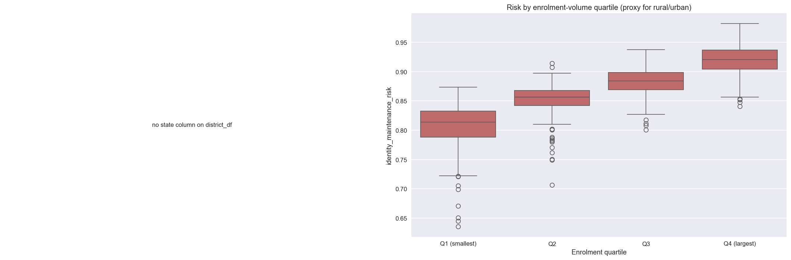

# Aadhaar Identity Maintenance Risk Framework

## Project Snapshot

| | |
|---|---|
| **Business problem** | Prioritise where limited mobile Aadhaar update capacity should be deployed across 714 districts. |
| **Quantified result** | The composite and naive rankings overlap in only **3 of the top 20**; however, the Aspirational District comparison is **not significant** (`p = 0.098`) and temporal top-20 overlap is only **10%**. |
| **Method** | District aggregation, transparent composite scoring, KMeans archetypes, bias slices, temporal hold-out testing, NITI cross-reference, and Prophet forecasting. |
| **Demo** | Run `streamlit run app.py`; a committed anonymised sample automatically enables demo mode. |
| **Limitations** | No authentication-failure labels exist, weights are heuristic, population volume affects the score, and the available 10-month window cannot validate the forecast. |
| **Reproduce** | `pip install -r requirements.txt` → `python tools/headline_numbers.py` → `streamlit run app.py`; verify with `pytest -q` and `ruff check .`. |



> District-level **prioritisation** engine that uses public Aadhaar
> enrolment / update data to flag where stale records are most likely to
> cause authentication failures and exclusion.
>
> **What this is**: a triage tool that reranks 714 districts by composite
> risk so resource allocators can decide where to send the next mobile
> update camp. **What this is not**: a validated predictor of authentication
> failures — there is no labelled ground truth for that anywhere in this
> repo, and the headline numbers below are honest about it.

[](https://github.com/Vatsalsrivastava1209/Aadhaar-Maintenance-Risk-Framework/actions/workflows/ci.yml)

---

## The problem

UIDAI publishes monthly enrolment and update data, but operationally the
question for any state IT department is **"where do we send the next mobile
update camp?"** Districts with high enrolment volume and a low update rate
accumulate stale biometric / demographic records, which cause downstream
authentication failures — and the people most affected are the ones who use
Aadhaar most often for entitlements.

The dataset answers "what's the volume" but not "where's the risk".

## What this project does

1. **Aggregates** enrolment, biometric, and demographic update records to the
   district level via a pincode → district mapping (~1M raw rows → 714 districts).
2. **Builds a composite risk index** with an explicit *Risk = P(failure) ×
   Impact* decomposition so each component can be argued with separately.
3. **Clusters** districts into archetypes on an enriched feature set
   (log-enrolment, update rate, balance, bio/demo ratio, growth slope) that
   does **not** reuse the index inputs — so the clusters describe something
   the index doesn't already encode.
4. **Forecasts** monthly update load per archetype with Prophet.
5. **Cross-validates against NITI Aayog** Aspirational Districts data using a
   curated alias map + fuzzy district matching, with a Welch's t-test +
   Hedges' *g* + 95% CI on the mean difference, then a **within-state
   stratified** comparison to strip out state-level confounders.

## Headline findings (May 2026 run, n = 714 districts)

All numbers below were captured by `tools/headline_numbers.py` against the
current public extracts.

### 1. The composite reranks aggressively vs the naive baseline

Compared with the trivial `1 − update_rate` baseline:

| Metric | Value | Interpretation |
|---|---|---|
| Spearman ρ | **0.142** (p = 1.5e−4) | Low correlation → the composite is *not* a relabelling of `1 − update_rate` |
| Top-20 overlap | **3 / 20** | The composite uniquely flags 17 districts the naive baseline misses |

The composite earns its complexity — but that doesn't make it *correct*.
Without ground-truth labels, this only shows the new ranking is different,
not better.

### 2. Aspirational vs Standard districts: a development-gap pattern, **not a significant difference**

The original framing of this comparison overclaimed. The honest numbers:

| Comparison | Δ mean risk | 95% CI | t | p | Hedges' g |
|---|---|---|---|---|---|
| Unadjusted | +0.0091 | [−0.0016, +0.0198] | 1.67 | **0.098** | 0.175 |
| Within-state demeaned | +0.0067 | — | 1.67 | 0.097 | — |

- p ≈ 0.10 in both cases — **does not clear α = 0.05**.
- Hedges' g = 0.175 — **negligible** effect size (|g|<0.2).
- 95% CI on the unadjusted difference **crosses zero**.
- The stratified result barely shrinks vs unadjusted, so the unadjusted gap
  is mostly already a within-state phenomenon, not a state-composition artefact.

**Honest framing**: this is *consistent with the broader development gap that
the Aspirational Districts programme was designed to address*. It is not
evidence of a measurably higher Aadhaar risk in aspirational districts.

### 3. The composite ranking is partially recovering population size

Bias slice — median risk by enrolment-volume quartile (a crude rural/urban proxy):

| Quartile | Median composite risk |
|---|---|
| Q1 (smallest) | 0.814 |
| Q2 | 0.857 |
| Q3 | 0.884 |
| Q4 (largest) | **0.921** |

A monotone trend by volume is a flag: the composite uses
`log1p(total_enrolments)` as its Impact term, so high-volume districts
mechanically score higher. The **per-capita view** (`risk_per_capita`,
which strips the Impact term) flips the geography — top-20 districts under
the two rankings overlap **only 5 / 20**, with the per-capita list
dominated by small northeastern districts (Meghalaya, Nagaland, etc.).

Read both views. The composite is the primary triage signal because
impact matters for resource allocation; per-capita is the secondary
sanity check that asks "are we finding risk, or finding population?"

### 4. Cluster archetypes are stable; the priority list is less so

| Stability metric | Value | Interpretation |
|---|---|---|
| Bootstrap KMeans ARI (30 resamples) | **0.83 ± 0.13** | Clusters are stable under data resampling |
| Temporal hold-out Spearman ρ (last 3 months held out, n=511 common) | **0.561** | Ranking moderately stable across time |
| Temporal hold-out top-20 overlap | **10 %** (2 / 20) | The bleeding-edge priority list is sensitive to time window |

The archetype labels are robust enough to drive policy framing. The
top-20 priority list is not — anyone acting on it should use a
rolling-window refresh, not a single-snapshot ranking.

### 5. Forecasting horizon is currently un-validated on this data window

The Prophet block in the notebook is wired for rolling-horizon CV, but
the current public extract spans only **10 months** (Mar–Dec 2025) and
`CONFIG["forecasting"]["cv_initial_months"]` requires 18 months of
history. The notebook prints "Insufficient history for cross_validation
— quoting forecast WITHOUT validated error bars." Don't read the raw
forecast as a validated number; this gets resolved once more months of
data accumulate.

## Tech stack

| Layer | Choice | Why |
|-------|--------|-----|
| Aggregation | pandas | Standard |
| Modelling   | scikit-learn (KMeans + MinMax + sensitivity), Prophet | Interpretable, hackable, plays well with policy audiences |
| Validation  | scipy.stats, rapidfuzz | Welch's t-test, within-state stratification, alias-aware fuzzy matching |
| Maps        | Plotly choropleth | One file, GitHub-renderable |
| Demo        | Streamlit | One-command shareable app, with demo-mode fallback |
| Hygiene     | ruff, pytest, nbstripout, pre-commit | Keeps the notebook reviewable |

## Run it

```bash
# 1. Clone
git clone https://github.com/Vatsalsrivastava1209/Aadhaar-Maintenance-Risk-Framework.git
cd Aadhaar-Maintenance-Risk-Framework

# 2. Install (pinned versions)
pip install -r requirements.txt

# 3a. The notebook
jupyter lab "UIDAI Project.ipynb"

# 3b. The Streamlit demo — works on a fresh clone via demo-mode fallback
streamlit run app.py

# 4. Verify the headline numbers in this README
python tools/headline_numbers.py

# 5. Tests + lint (dev workflow)
pip install -r requirements-dev.txt
pytest -q
ruff check .
```

**Note on data**: the raw CSV folders under `datasets/api_data_aadhar_*`
are gitignored because of size. A small **anonymised sample** lives under
`datasets/sample/` and is committed — `app.py` falls back to it
automatically when the real folders aren't present, so a fresh clone can
boot the Streamlit demo without any extra setup. Drop the real UIDAI
extracts under `datasets/api_data_aadhar_{enrolment,biometric,demographic}/`
to switch.

## Repository layout

```
.
├── UIDAI Project.ipynb       # Main analysis (stripped of outputs)
├── app.py                    # Streamlit demo with demo-mode fallback
├── utils/
│   ├── config.py             # Tunable weights + thresholds
│   └── helpers.py            # All numerical logic (risk, per-capita, hold-out, sensitivity)
├── tests/test_helpers.py     # Pytest cases for utils/
├── tools/
│   ├── headline_numbers.py   # Reproduces every number in this README
│   ├── build_sample_datasets.py  # Builds the anonymised sample under datasets/sample/
│   ├── apply_notebook_edits.py   # Idempotent notebook surgery script
│   └── rewrite_notebook.py   # Earlier one-time rewrite script (kept for history)
├── datasets/sample/          # Committed anonymised sample (real datasets/ are gitignored)
├── .github/workflows/ci.yml  # Lint + tests + notebook-size guard
├── .pre-commit-config.yaml   # ruff + nbstripout
├── ARCHITECTURE.md           # Productionisation story
├── financial_inclusion.csv   # NITI Aayog reference
├── pincode_directory.csv     # Pincode → district map
├── india_districts.json      # GeoJSON for choropleth
└── plots/                    # Saved figures (bias_slice.png, demographic_updates_heatmap.png)
```

## Limitations

Read these before quoting the findings.

- **No ground-truth labels.** The risk index is built from operational
  proxies (update rate, balance, volume), not from actual authentication
  failure incidence. Without a labelled set of "districts where Aadhaar
  failures occurred at rate X", the index is plausible but not validated.
  This is the most important limitation; everything else is secondary.
- **Weights are heuristic.** Composite weights in `utils/config.py` are
  defensible defaults, not learned from data. The sensitivity analysis in
  the notebook shows the *robustness* of rankings under ±15% jitter, but
  cannot tell you the weights are *right*.
- **The composite encodes population size.** A monotone risk trend across
  enrolment quartiles (see Headline finding #3) means the index is
  partially recovering volume rather than risk-per-person. The
  `risk_per_capita` column is the corrective view; use both.
- **NITI cross-reference does not reach significance.** Headline finding
  #2 is reported with full transparency — the previous draft of this
  README quoted a "measurably higher" claim that the data does not
  support.
- **District-name joins are imperfect.** Even with a curated alias map
  plus rapidfuzz fallback, some NITI / Aadhaar district names do not
  match cleanly. Coverage is reported in the notebook; a proper fix is to
  migrate everything to LGD district codes.
- **Forecast horizon is currently un-validated.** Data span (10 months)
  is shorter than the rolling-window CV requires (18-month initial). The
  notebook says so honestly and prints forecasts without error bars.
- **Top-20 priority list is time-window sensitive.** Hold-out top-20
  overlap is 10% — the bleeding edge moves a lot. Use rolling refresh,
  not a single-snapshot ranking.

## Ethical considerations

This project risk-scores **regions, not individuals**, and uses only
aggregated public data. Even so:

- **Stigmatisation risk**: any geographic risk model can be misused to
  justify resource withdrawal from "risky" areas. The intended use is the
  opposite — prioritise *more* outreach to high-risk districts.
- **Disparate impact**: the bias slice in the notebook
  (`plots/bias_slice.png`) shows risk distribution by state and by
  enrolment-volume quartile. The monotone trend by volume documented in
  Headline finding #3 is the main known disparate-impact pattern; the
  per-capita view is the corrective. A production deployment should
  extend this to Scheduled-Area classification and urban / rural codes
  from the Census.
- **Privacy**: no PII is used or required. Inputs are public aggregates.
  The committed `datasets/sample/` replaces real pincodes with surrogate
  codes (`SAMPLE_PIN_xxxxx`); see `tools/build_sample_datasets.py`.

## What I'd do with another two weeks

1. **Acquire authentication-failure labels** from UIDAI ops and learn the
   weights (logistic regression / gradient-boosted classifier) rather
   than heuristically setting them. This is the single highest-leverage
   change because it converts the index from a prioritisation tool into
   a predictor.
2. **Causal angle**: where mobile camps have been deployed historically,
   estimate the lift on update rate using propensity-score matching or a
   regression-discontinuity around the risk threshold.
3. **Per-capita with real population**: 2011 Census + extrapolated
   district population, so "impact" can be a proper rate rather than a
   log-volume proxy.
4. **Replace district-name joins with LGD codes** end-to-end.
5. **Refit Prophet** once 18+ months of data are available so CV produces
   real MAPE per archetype.
6. **Ship the FastAPI scoring service** sketched in `ARCHITECTURE.md`.

## Acknowledgements

UIDAI for the open enrolment/update data, NITI Aayog for the Champions of
Change dashboard data, and India Post for the pincode directory.

Issues / feedback welcome via GitHub.
